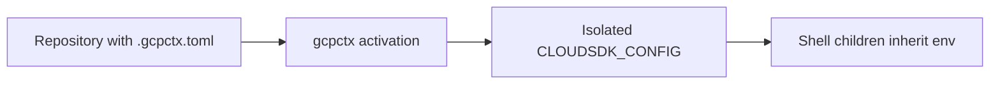

# ADR 0003: Directory-scoped Google Cloud contexts via isolated CLOUDSDK_CONFIG

- **Status:** Accepted
- **Date:** 2026-06-23
- **Deciders:** Maintainers

## Context

Developers and coding agents need Google Cloud access scoped to a repository without inheriting a broad user credential or mutating global CLI state. Alternatives include editing `~/.config/gcloud`, exporting custom token environment variables, or running a local credential broker.

## Decision

`gcpctx` activates directory-scoped contexts by exporting an isolated `CLOUDSDK_CONFIG` path under the user cache. Each activated profile gets a deterministic context directory. Child processes (IDE terminals, agents, `gcloud`, client libraries using ADC) inherit the exported environment. Project roots are discovered by walking upward for `.gcpctx.toml`.

**Stable invariants:**

- Never write to the user's global Google Cloud SDK config directory.
- Every `gcloud` subprocess for an active context receives the isolated `CLOUDSDK_CONFIG`.

## Consequences

- Multiple repositories can hold different active contexts in separate shells.
- Global `gcloud` configuration remains untouched.
- Tools that do not inherit the shell environment need explicit activation guidance (`doctor`, README).

## Alternatives considered

- **Mutate global gcloud config:** Rejected — races across shells and agents; hard to audit.
- **Token env vars / custom credential format:** Rejected — reinvents Google primitives; poor `gcloud` compatibility.
- **Local credential broker daemon:** Deferred — operational complexity for v0.1.
- **VSCode/Cursor extension:** Deferred — shell inheritance suffices for v0.1.

## Trade-offs

- Requires shell integration or manual `eval` for activation.
- Isolated configs consume disk under the user cache.
- POSIX-focused in v0.1 (macOS/Linux).

## References

- [Google Cloud SDK configurations](https://cloud.google.com/sdk/docs/configurations)
- ADR-0004 (impersonation), ADR-0005 (trust model), ADR-0006 (shell contract)
