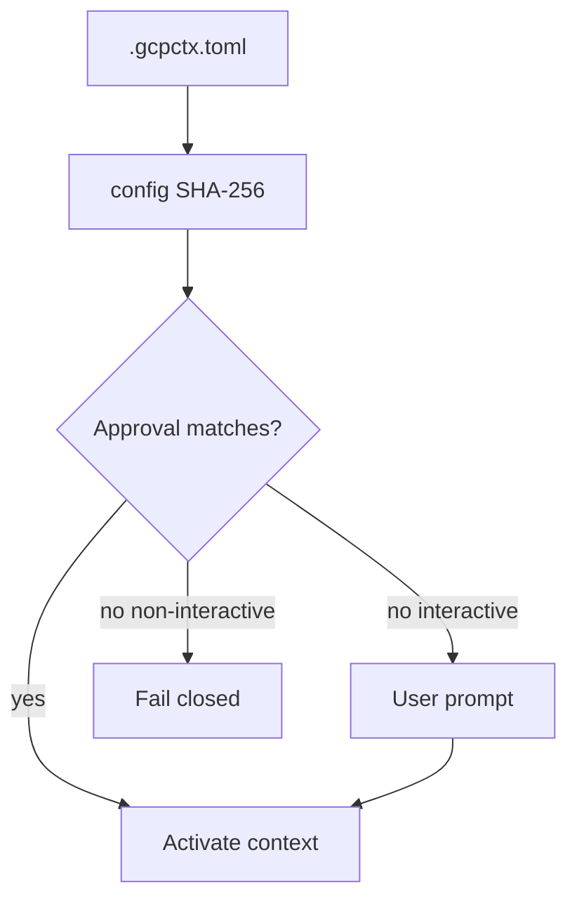

# ADR 0005: Repository trust model for project-local configuration

- **Status:** Accepted
- **Date:** 2026-06-23
- **Deciders:** Maintainers

## Context

`.gcpctx.toml` is project-local and potentially untrusted (e.g. cloned repositories). Silent activation could bind a shell or agent to an attacker-chosen service account. State files on disk must not be world-readable.

## Decision

First activation of a directory/profile/project/service-account binding requires explicit user approval. Approvals are stored in the user config area with restrictive permissions and match on:

- Canonical repository root path
- Profile name, project ID, service account email
- SHA-256 of raw `.gcpctx.toml` bytes
- Schema version

Users may approve once or remember approval. Config or identity changes invalidate prior approvals. **Non-interactive mode fails closed** without a matching approval. Config and state paths are created with `0700` directories and `0600` files where POSIX `chmod` applies.

## Consequences

- Coding agents and CI must pre-approve or run interactively once.
- Changing service account or project requires re-approval.
- Unsafe permissions on config or state raise errors rather than proceeding silently.

## Alternatives considered

- **Implicit trust of repo config:** Rejected — unsafe for cloned repos and agents.
- **Org-wide allowlist only:** Deferred — v0.2 consideration.
- **Daemon-mediated consent:** Rejected for v0.1 — unnecessary complexity.

## Trade-offs

- Extra friction on first use per binding.
- Remembered approvals persist until config changes or explicit revoke.

## References

- ADR-0003 (isolation), ADR-0007 (config validation)
- `gcpctx approve`, `gcpctx revoke` commands
