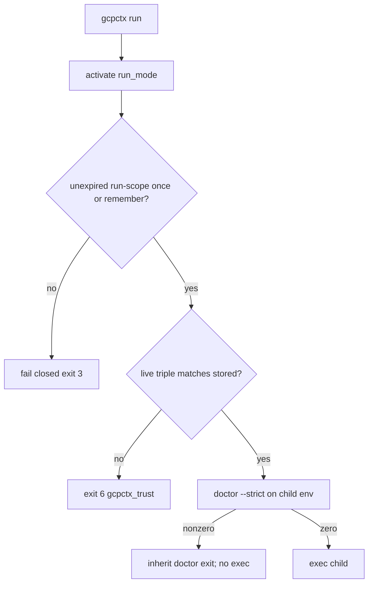

# ADR 0010: Pin gcpctx, fail-closed `run`, 8h run TTL

- **Status:** Accepted
- **Date:** 2026-08-23
- **Deciders:** Maintainers

## Context

`gcpctx run` is the credential handoff for coding agents. CLOUDSDK isolation only keeps `~/.config/gcloud` clean. Same-user agents are not a security boundary: a process that can write the user's cache or swap the on-PATH launcher can impersonate gcpctx without crossing a kernel user boundary.

Path+hash approval remains workstation consent (resolved root + profile + project + SA + toml hash). It is not git remote, commit, or org PAM.

Two gaps follow:

1. A 30-day shell remember (`policy.approval_ttl_days`) currently authorizes `run` as well as `activate` / hook eval. Agent credential handoff needs a shorter clock that the shell session must not inherit.
2. gcloud is pinned (path + SHA-256, schema v2, doctor exit 6). The Hatchling console script is a thin launcher. Pinning only the wrapper misses a `site-packages/gcpctx` swap; pinning only the interpreter and module misses a PATH-hijacked launcher that never imports us.

## Decision

**`gcpctx run` is fail-closed on `doctor --strict`.** After activation, evaluate the same strict checks against the **child** environment (isolated `CLOUDSDK_CONFIG`, GAC policy already applied). Inherit that exit code. Do not exec the child on non-zero. Hook eval does **not** run full strict doctor (latency on every `cd`); it always enforces gcpctx identity plus shell-scope approval.

**8 hour TTL is a property of `run`, not an SA label and not `policy.approval_ttl_days`.** Two approval scopes:

- `shell` — `gcpctx approve` or remember in the activate/hook prompt; TTL `approval_ttl_days` (default 30); accepted by `activate` / hook only.
- `run` — `gcpctx approve --run` or once from the run prompt; TTL 8 hours; accepted by `gcpctx run` only.

`run` accepts `once` with `run` scope or an unexpired `run`-scope remember. Non-interactive `run` without that fails closed (exit 3). A valid 30-day shell remember must not authorize `run`.

**Pin the `gcpctx` binary the same way we pin `gcloud`.** Reuse approval schema v2 (add fields; do not bump `schema_version`) and doctor exit 6. Identity is a **triple**, each path + SHA-256, stored on the approval:

1. resolved `argv[0]` (console script / wrapper)
2. `sys.executable`
3. `gcpctx` module origin, or the installed dist RECORD hash (verify files against RECORD when present)

Doctor check `gcpctx_trust` fails on any mismatch (exit 6). Always on for `run` and hook eval.

`gcpctx install` / hook snippets must emit the absolute launcher path, never a bare `gcpctx` on PATH.

**Stable invariants:**

- Workstation consent key stays resolved root + profile + project + SA + toml hash (ADR-0005). Clone or copy of the tree is a new path. Same-path toml rewrite still invalidates via hash.
- `policy.toml` and `audit.jsonl` are laptop-local; they are not org PAM or a shared-host control plane.
- Same-user agents are not a security boundary.
- CLOUDSDK isolation does not protect against a swapped gcpctx launcher, interpreter, or package.

## Consequences

- Agents must `gcpctx approve --run` (or approve once interactively under `run`) before non-interactive `gcpctx run`.
- Existing remembered shell approvals do not authorize `run`. Hook eval and `run` require a stored gcpctx triple; missing pins fail `gcpctx_trust` (exit 6) until re-approval.
- Every `gcpctx run` pays `doctor --strict` cost on the child context, including the IAM impersonation probe when ADC exists.
- Users must re-run `gcpctx install` after moving the launcher so hook snippets keep the absolute path.

## Alternatives considered

- **Origin URL as the approval key:** Deferred — path+hash remains workstation consent, not git remote.
- **Remote revoke / origin-bound or signed approvals / org PAM:** Deferred.
- **Moving ADC out of XDG cache:** Recommend later; not blocking.
- **Parent-env `doctor --strict` before activate:** Rejected — parent typically has `CLOUDSDK_CONFIG` unset, so `ambient_cloudsdk` would always fail.
- **Reuse 30-day shell remember for `run`:** Rejected — agent handoff must not inherit a month-long shell grant.
- **Wrapper-only or interpreter+module-only pin:** Rejected — each misses a swap the other does not see.

## Trade-offs

- Extra friction: a second grant (`--run`) and an 8-hour refresh for agents.
- Strict doctor on every `run` adds latency (IAM probe) in exchange for inheriting the compliance gate instead of drifting a parallel checklist.
- Editable installs hash the package tree; wheel installs verify RECORD. Either is slower than hashing a single gcloud binary; cache by mtime/size.

## References

- ADR-0005 (repository trust model; path + toml hash)
- ADR-0008 (process-scoped `run`; amended: run no longer shares activate's approval grant)
- ADR-0009 (gcloud path + SHA-256 on schema v2; doctor `--strict`; audit JSONL)
- `SECURITY.md` (laptop-local policy and audit)
