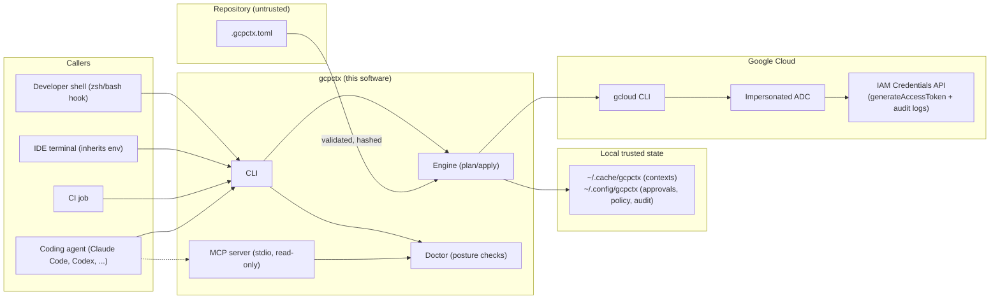
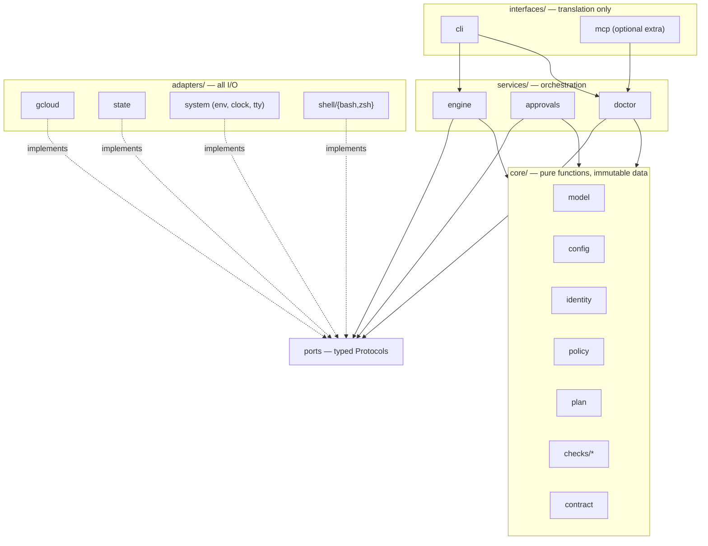
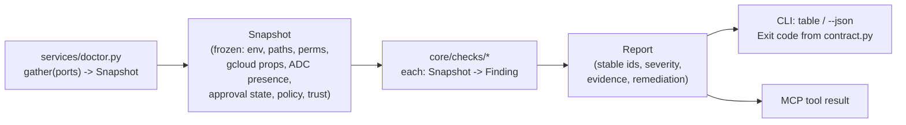
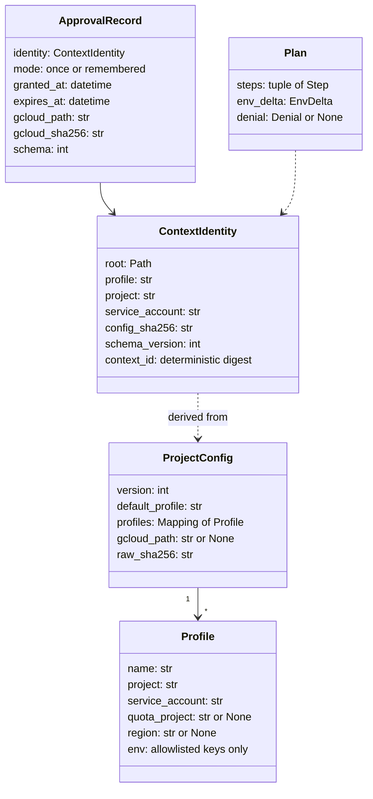
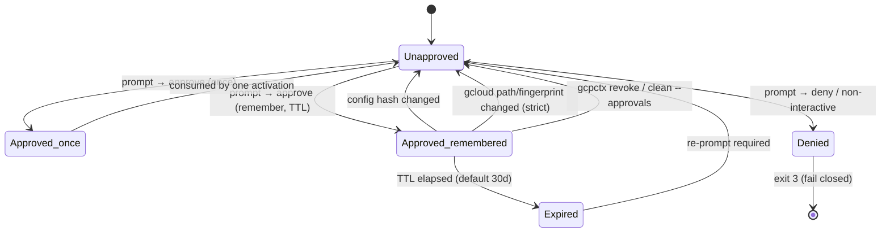
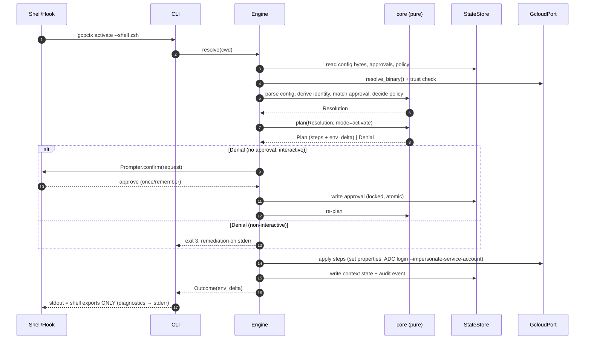
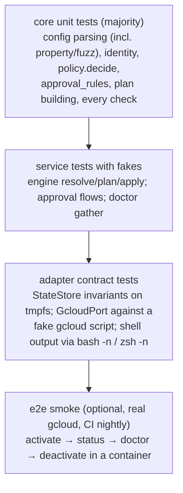

# RFC 0001: gcpctx clean-slate redesign

- **Status:** Draft
- **Date:** 2026-07-08
- **Deciders:** Maintainers
- **Supersedes:** Nothing (ADR-0003 … ADR-0009 remain the record of v0.x decisions; this RFC proposes the architecture a from-scratch reimplementation would use)

---

## 1. Summary

gcpctx provides **directory-scoped, keyless Google Cloud impersonation contexts** for
terminals, IDEs, and coding agents. The v0.x implementation proved the product idea and
the security model. This RFC answers: *if we restarted today, how would we structure the
software* so it stays **security- and governance-aware**, and **easy to maintain, test,
and extend** — without over-engineering.

The redesign keeps every externally proven contract (config schema, approval semantics,
doctor JSON contract, exit codes, CLI surface) and changes the **internal shape**:

1. A **pure core** (no I/O, no subprocess, no environment reads) that computes
   *decisions* and *plans*.
2. A small set of **ports** (typed interfaces) implemented by **adapters** for gcloud,
   the filesystem state store, the OS environment, and shells.
3. A **plan/apply split** for every mutation — the security-relevant reasoning is a pure
   function whose output can be printed, audited, and tested; side effects happen in one
   place.
4. A thin **interface layer** — the CLI today, an optional **read-only MCP server**
   tomorrow — that never contains logic, only translation.

Everything else — daemon, broker, plugin system, async runtime, DI framework, Windows —
is explicitly *not* built (§15).

---

## 2. Motivation: what v0.x taught us

The v0.x codebase (~4,100 lines across 26 modules) is functionally sound but its shape
resists change:

| Pain point | Evidence in v0.x | Consequence |
| --- | --- | --- |
| Probing and judging are fused | `doctor.py` (656 lines) shells out to gcloud, reads env, *and* decides pass/warn/fail in the same functions | Every doctor test needs subprocess/env monkeypatching; adding a check touches orchestration |
| Cross-module coupling | `activation.py` imports `approvals`, `gcloud`, `gcloud_trust`, `audit` directly; `approvals.py` imports `rich`, runs `git` subprocesses, and loads policy | No seams; unit tests become integration tests |
| Side effects scattered | gcloud writes happen inside activation; approval writes inside prompting; audit writes inside everything | Hard to answer "what exactly will this command change?" before it runs |
| Contracts implicit | Exit codes, check ids, and JSON shapes live in three modules plus docs | v0.2→v0.3 exit-code remap was breaking and manual |
| Interface knows too much | `cli.py` (541 lines) sequences discovery → trust → approval → init → render per command | New interfaces (MCP, hooks) would duplicate that sequencing |

None of this is a rewrite-for-taste argument. The trigger is the **next requirements** —
agent-facing interfaces (MCP, Claude Code hooks), more doctor checks, more shells, a
possible Windows story — all of which multiply against the current coupling.

### What v0.x got right (kept verbatim)

- **Isolation primitive:** exported `CLOUDSDK_CONFIG` per context (ADR-0003). Google's
  documented mechanism for relocating *all* gcloud state; child processes inherit it.
- **Keyless auth:** service-account impersonation for both gcloud
  (`auth/impersonate_service_account`) and ADC
  (`gcloud auth application-default login --impersonate-service-account`) (ADR-0004).
  No long-lived keys, short-lived tokens (1 h default, 12 h max via org policy), and
  server-side IAM audit logs for every `generateAccessToken` call.
- **Trust model:** repo config is untrusted input; first-use approval bound to a
  SHA-256 of the config; non-interactive fail-closed (ADR-0005, ADR-0007).
- **Process-scoped `run`:** credentials confined to one child process (ADR-0008).
- **Machine contract:** `doctor --strict --json` with stable check ids and exit codes.
- **Hardening set:** atomic/locked/symlink-safe writes, `0600`/`0700`, gcloud binary
  trust, policy allowlists, append-only audit (ADR-0009).

---

## 3. Goals and non-goals

### Goals

- **G1 — Security invariant preserved:** for any activated process, effective project,
  ADC context, impersonated service account, quota project, and credential-relevant env
  vars match the approved profile and active policy, **or activation fails closed**.
- **G2 — Auditable by construction:** every mutation derives from an inspectable
  `Plan`; every security decision is a pure function that can be replayed in a test.
- **G3 — Testable without mocking the world:** ≥80 % of logic testable with in-memory
  fakes; subprocess/env mocking confined to adapter contract tests.
- **G4 — Extensible along known axes:** new doctor check, new shell, new interface
  (MCP), new policy rule — each is additive, touching one layer.
- **G5 — Agent-native:** first-class, *safe* integration with coding agents: `run`,
  strict doctor as a preflight gate, documented Claude Code hooks, optional read-only
  MCP server.
- **G6 — Simple:** stdlib + the four existing runtime deps (pydantic, rich, tomli-w,
  typer-or-argparse); no new frameworks.

### Non-goals

- Replacing Google IAM design, org policy, PAM, or endpoint management.
- A credential broker/daemon, token caching layer, or background refresher (google-auth
  refreshes ADC client-side; gcloud manages its own token cache).
- Windows support (fail-closed exit 10 stays until an ACL-backed state store exists).
- A general plugin system or public Python API stability guarantees beyond the CLI/JSON
  contracts.

---

## 4. Design principles

1. **Functional core, imperative shell.** All parsing, validation, identity derivation,
   policy decisions, approval matching, plan construction, and check evaluation are pure
   functions over immutable values. I/O lives at the edges.
2. **Plan, then apply.** Nothing writes to disk or calls gcloud except the applier
   executing a previously computed, printable `Plan`. `--dry-run` falls out for free;
   so does audit fidelity (the audit event *is* the plan summary).
3. **One writer.** Exactly one adapter (`StateStore`) touches managed state, enforcing
   atomicity, locking, symlink rejection, and permissions in one place.
4. **Fail closed, degrade loudly.** Ambiguity (unapproved config, untrusted gcloud,
   unreadable state, non-POSIX platform) is an error with a stable exit code, never a
   silent fallback.
5. **Contracts are code.** Exit codes, check ids, JSON schema versions, and env-var
   names live in a single `contract` module with tests that freeze them.
6. **Boring technology.** Protocols + constructor injection, frozen dataclasses in the
   core, pydantic only at parse boundaries. No DI container, no async, no metaclasses.
7. **Least privilege for machine callers.** Anything callable by an agent (MCP tool,
   hook, `--json` command) is read-only or scoped to one child process. Consent
   (approval) is only ever granted through a human-interactive path.

---

## 5. Grounding in official references

The redesign was checked against the primary sources; these facts are load-bearing:

**Google Cloud**

- `CLOUDSDK_CONFIG` relocates the *entire* gcloud config directory — the documented
  isolation mechanism we build on. Named configurations
  (`CLOUDSDK_ACTIVE_CONFIG_NAME`) share credential state and are therefore *not* a
  sufficient isolation boundary for our threat model.
  ([gcloud configurations](https://cloud.google.com/sdk/docs/configurations))
- gcloud properties can be overridden by `CLOUDSDK_SECTION_PROPERTY` env vars —
  which is why the core validates and controls the exported env surface and why
  `CLOUDSDK_CORE_PROJECT` is always set from the profile, never from repo config.
- Impersonation requires `roles/iam.serviceAccountTokenCreator`
  (`iam.serviceAccounts.getAccessToken`) on the target SA; impersonated credentials
  "do not persist"; every mint is captured by IAM Credentials API audit logging —
  gcpctx inherits Google-side governance for free.
  ([SA impersonation](https://cloud.google.com/docs/authentication/use-service-account-impersonation),
  [short-lived credentials](https://cloud.google.com/iam/docs/create-short-lived-credentials-direct))
- ADC search order is `GOOGLE_APPLICATION_CREDENTIALS` → well-known file under the
  gcloud config dir → attached SA/metadata server. This is why GAC is unset by default
  during activation (it would override the isolated impersonated ADC) and why the
  well-known file lands inside the isolated `CLOUDSDK_CONFIG`.
  ([ADC](https://cloud.google.com/docs/authentication/application-default-credentials))
- Token lifetime is 1 h by default, extensible to 12 h only via
  `constraints/iam.allowServiceAccountCredentialLifetimeExtension` — no gcpctx-side
  token supervision needed or wanted.

**MCP (spec 2025-11-25, security best practices)**

- Tools are "arbitrary code execution and must be treated with appropriate caution";
  hosts must obtain explicit user consent before invoking tools. → gcpctx's MCP surface
  is **read-only diagnostics**; approval granting is *never* an MCP tool.
- Local servers should prefer **stdio transport** to limit access to the spawning
  client; HTTP-on-localhost invites DNS-rebinding/session attacks. → stdio only.
- Scope minimization: expose the minimal tool set; avoid omnibus capabilities. → three
  tools (§12.2), all idempotent reads.
- Token passthrough is forbidden. → the MCP server never handles or returns Google
  tokens/credentials, only posture metadata.
  ([MCP security best practices](https://modelcontextprotocol.io/specification/2025-11-25/basic/security_best_practices))

**Claude Code**

- Hooks receive JSON on stdin; exit 2 blocks the action; exit 0 + JSON can inject
  context or decide permissions; `SessionStart` can persist env via `CLAUDE_ENV_FILE`.
  → `doctor --strict --json` is shaped to be a drop-in `SessionStart`/`PreToolUse`
  gate (§12.3). ([Claude Code hooks](https://code.claude.com/docs/en/hooks))
- Project-scoped `.mcp.json` is checked into the repo and requires per-user approval
  before Claude Code will run it; stdio servers run as local processes. → we ship a
  documented `.mcp.json` snippet, not auto-installation.
  ([Claude Code MCP](https://code.claude.com/docs/en/mcp))

---

## 6. System context



Trust boundaries (unchanged from v0.x, restated because the architecture is organized
around them):

| Boundary | Trust | Handling |
| --- | --- | --- |
| `.gcpctx.toml` | **Untrusted** | Strict schema, conservative regexes, env allowlist, SHA-256 bound into approval + context identity |
| `~/.config/gcpctx`, `~/.cache/gcpctx` | Trusted user state | Single `StateStore` writer: atomic, locked, `O_NOFOLLOW`, `0600`/`0700` |
| `gcloud` binary | Conditionally trusted | Path trust checks; optional pin + fingerprint bound into approval |
| `policy.toml` | User/org policy | Validated; strict mode fails closed |
| MCP client / hooks | Machine caller | Read-only surface; no consent, no credentials |

---

## 7. Architecture

### 7.1 Layers and the dependency rule



**Dependency rule:** arrows only point downward/inward. `core/` imports nothing but the
stdlib and pydantic. `services/` import `core` and `ports`. `adapters/` implement
`ports` and may import `core` types. `interfaces/` import `services` only. Enforced in
CI by an import-linter contract (one config block, not a framework).

### 7.2 Module layout

```text
src/gcpctx/
├── core/                    # PURE. No os/env/subprocess/filesystem imports.
│   ├── model.py             #   Frozen dataclasses: Profile, ProjectConfig,
│   │                        #   ContextIdentity, ApprovalRecord, Snapshot, Finding…
│   ├── config.py            #   bytes -> ProjectConfig (strict schema v1/v2)
│   ├── identity.py          #   ContextIdentity derivation (root, profile, project,
│   │                        #   SA, config SHA-256, schema version)
│   ├── policy.py            #   policy schema + decide(policy, facts) -> Decision
│   ├── approval_rules.py    #   match/expiry logic: (ledger, identity, now) -> Match
│   ├── plan.py              #   build_activation_plan(...) -> Plan (steps + env delta)
│   ├── checks/              #   one module per doctor check: (Snapshot) -> Finding
│   │   └── registry.py      #   CHECKS: ordered, id-keyed, severity, remediation
│   └── contract.py          #   ExitCode enum, check ids, JSON schema versions,
│                            #   GCPCTX_* env names — the frozen public surface
├── ports.py                 # Protocols: GcloudPort, StateStore, EnvPort, Clock,
│                            # Prompter, AuditSink, ShellRenderer
├── adapters/
│   ├── gcloud.py            # subprocess (argv arrays, isolated CLOUDSDK_CONFIG),
│   │                        # binary resolution + trust validation
│   ├── state.py             # the ONLY writer: atomic, flock, O_NOFOLLOW, 0600/0700
│   ├── system.py            # real env/clock/tty-prompter
│   └── shell/               # bash.py, zsh.py: EnvDelta -> shell text (quote-safe)
├── services/
│   ├── engine.py            # resolve() -> plan() -> apply(); activate/run/deactivate
│   ├── approvals.py         # consent ledger: grant (interactive only), revoke, query
│   ├── doctor.py            # gather Snapshot via ports -> run core.checks -> Report
│   └── audit.py             # structured events -> AuditSink
├── interfaces/
│   ├── cli/                 # arg parsing, table/JSON rendering, exit-code mapping
│   └── mcp/                 # optional [mcp] extra: stdio server, 3 read-only tools
└── tests/                   # mirrors the tree; fakes for every port in tests/fakes.py
```

Size expectation: this is a reorganization of ~4 kLOC, not an expansion. The core is
smaller than today's equivalent code because gathering and judging are no longer
interleaved.

### 7.3 Ports

| Port | Methods (sketch) | Real adapter | Test fake |
| --- | --- | --- | --- |
| `GcloudPort` | `resolve_binary()`, `get_property()`, `set_property()`, `adc_login_impersonated()`, `probe_impersonation()` | subprocess + trust checks | in-memory property map, scripted probe results |
| `StateStore` | `read(key)`, `write(key, bytes)`, `delete(key)`, `lock(key)` | atomic/locked/symlink-safe files | dict |
| `EnvPort` | `get(name)`, `snapshot()` | `os.environ` (read-only!) | dict |
| `Clock` | `now()` | UTC | fixed/steppable |
| `Prompter` | `confirm(ApprovalRequest) -> ApprovalAnswer` | rich TTY UI | scripted answers |
| `AuditSink` | `emit(Event)` | append-only JSONL via StateStore | list |
| `ShellRenderer` | `render(EnvDelta) -> str` | bash/zsh emitters | n/a (pure already) |

Notes:

- `EnvPort` has **no setter**: gcpctx never mutates its own process env; it only emits
  shell code or constructs a child env. This makes the "who can change the environment"
  question answerable by grep.
- `Prompter.confirm` is the **only** path that can create an approval. The MCP
  interface and `--json` modes are constructed without a `Prompter` (a `NullPrompter`
  that always fails closed), making "agents cannot self-approve" a type-level property,
  not a runtime convention.

### 7.4 The plan/apply engine

```python
# services/engine.py (sketch)
class Engine:
    def resolve(self, cwd: Path) -> Resolution:        # pure inputs gathered via ports
        ...                                            # root, config, identity, policy,
                                                       # approval match, gcloud trust
    def plan(self, res: Resolution, mode: Mode) -> Plan:   # PURE (delegates to core.plan)
        ...                                            # ordered Steps + EnvDelta + denials
    def apply(self, plan: Plan) -> Outcome:            # the only side-effectful path
        ...                                            # gcloud writes, state writes, audit
```

A `Plan` is a frozen value:

- `steps`: ordered, typed (e.g. `EnsureContextDir`, `SetGcloudProperty`,
  `InitImpersonatedAdc`, `WriteContextState`) — each maps 1:1 to one port call.
- `env_delta`: exports/unsets/backups (`GCPCTX_PREV_*`) — the single source for shell
  renderers *and* `run`'s child environment, so hook mode and run mode cannot drift.
- `denial`: if the plan is a refusal (no approval, policy violation, untrusted gcloud),
  it carries the stable exit code and remediation instead of steps.

`activate`, `hook`, and `run` are the same `resolve → plan → apply` pipeline with
different modes and different consumers of `env_delta` (shell text vs. child environ).
`--dry-run` prints the plan and exits; the audit event for an activation is the plan
summary plus the outcome.

### 7.5 Doctor as snapshot + pure checks



- Probes are the only doctor code touching ports; expensive probes (IAM impersonation
  `generateAccessToken` dry-run) populate the snapshot only in `--strict`.
- Every check is a pure function with a spec entry in `core/checks/registry.py`
  (id, severity, exit code, doc link). Adding a check = one module + one registry row +
  one docs page. The registry is the generator for `docs/doctor-contract.md`, so code
  and contract cannot diverge.
- The same `Report` serves the CLI, the strict CI gate, hooks, and the MCP server.

---

## 8. Domain model and state

### 8.1 Core values (all frozen)



Identity derivation keeps the v0.x property that **any trust-relevant change (project,
SA, config bytes, schema) yields a new context id** — old state is abandoned, never
mutated, and the approval no longer matches (re-consent required).

### 8.2 On-disk layout (unchanged semantics, one owner)

```text
~/.config/gcpctx/
├── approvals.json      # consent ledger (schema v2: gcloud path+sha bound)
├── policy.toml         # optional; or $GCPCTX_POLICY_PATH
├── settings.toml       # user settings (v1/v2 accepted; unknown keys ignored)
└── audit.jsonl         # append-only events, no credential material
~/.cache/gcpctx/contexts/<context_id>/
├── gcloud/             # the isolated CLOUDSDK_CONFIG
│   └── application_default_credentials.json   # impersonated ADC (written by gcloud)
└── state.json          # context bookkeeping (init timestamps, debounce)
```

All writes go through `StateStore`; managed dirs self-repair to `0700` when
user-owned, then validate (a learned v0.x behavior worth keeping).

### 8.3 Approval lifecycle



---

## 9. Security and governance architecture

### 9.1 Invariant → enforcement → verification map

The security invariant (G1) is enforced at plan time and verified by doctor. Because
plans and checks are pure functions over the same core model, each row is unit-tested
twice — once as "the plan refuses" and once as "the check fails":

| Guarantee | Enforced by (plan-time) | Verified by (check id) |
| --- | --- | --- |
| Project identity immutable | `core.plan` always exports `CLOUDSDK_CORE_PROJECT=profile.project`; repo `env` cannot contain it | `env_project`, `gcloud_project` |
| Impersonation matches profile | `SetGcloudProperty(auth/impersonate_service_account)` step from profile only | `impersonation`, `impersonation_iam` (strict) |
| Isolated `CLOUDSDK_CONFIG` | context dir derived from `ContextIdentity`; never global dir | `ambient_cloudsdk`, `expected_context` |
| ADC not overridden | `env_delta` unsets `GOOGLE_APPLICATION_CREDENTIALS` (backup/restore); opt-out flag only | `gac` |
| Consent before credentials | `plan()` returns `Denial(exit=3)` without a matching, unexpired approval; `NullPrompter` for machine callers | `approval`, `approval_expiry` |
| Trusted gcloud | trust validation in `GcloudPort.resolve_binary()`; path+sha bound in approval | `gcloud_trust` |
| Safe state posture | `StateStore` invariants (atomic, flock, `O_NOFOLLOW`, modes) | `state_permissions` (strict) |
| Org policy | `core.policy.decide()` consulted in `plan()`; strict mode fails closed | `policy` |
| POSIX only | platform gate in `contract`/bootstrap (exit 10) | n/a (cannot run) |

### 9.2 Governance features

- **Audit log:** every `apply()` outcome, approval grant/revoke/expiry, policy denial,
  and doctor-strict failure emits a structured JSONL event (event type, context id,
  identity fields, plan summary, outcome). Never tokens, ADC contents, or GAC paths.
  Google-side, every impersonated token mint is independently logged by the IAM
  Credentials API — gcpctx's local log answers *"what did this workstation decide and
  why"*, Cloud Audit Logs answer *"what credentials were actually minted"*.
- **Policy (`policy.toml`):** pure `decide(policy, facts)` in the core; org-style
  allowlists for projects/SAs/gcloud paths, approval TTL, strict-mode toggles.
  Default remains permissive-but-safe (P0 invariants always on) per the project's
  security/UX balance; strictness is opt-in.
- **Compliance gate:** `gcpctx doctor --strict --json` stays the single machine gate
  for CI, agent preflight, and hooks — stable ids, stable exit codes, generated docs.

### 9.3 Threats revisited (delta vs. v0.x)

No new mitigations are required by the reorganization; two get *stronger*:

- **Repo-config injection:** unchanged schema strictness, but now the entire untrusted
  → trusted transition is one function (`core.config.parse`) with one fuzz/property
  test target.
- **TOCTOU between check and use:** plan/apply narrows the window: `apply()` re-asserts
  preconditions recorded in the plan (config hash, gcloud fingerprint) before executing
  steps, and aborts with the same exit codes if anything moved.

New surface introduced by this RFC (MCP) is analyzed in §12.2.

---

## 10. Key flows

### 10.1 Activation (shell or hook)



### 10.2 Process-scoped `run` (primary agent path)

```mermaid
sequenceDiagram
    autonumber
    participant User
    participant CLI as gcpctx run -- claude
    participant Eng as Engine
    participant Child as Child process (agent)

    User->>CLI: gcpctx run -- claude
    CLI->>Eng: resolve → plan(mode=run) → apply
    Note over Eng: same pipeline; NullPrompter if non-interactive → exit 3
    Eng-->>CLI: Outcome(env_delta)
    CLI->>Child: spawn(argv, env = parent env + env_delta)
    Note over Child: inherits isolated CLOUDSDK_CONFIG + impersonated ADC,<br/>GOOGLE_APPLICATION_CREDENTIALS unset
    Child-->>CLI: exit code (propagated)
    Note over User: parent shell environment untouched
```

### 10.3 Doctor

Identical pipeline (§7.5 diagram) for the CLI table, `--json`, the strict CI gate,
Claude Code hooks, and the MCP tool — one report shape, many renderers.

---

## 11. Interface contracts

### 11.1 CLI surface (kept from v0.5, frozen)

`create · approve · revoke · activate · deactivate · hook · install · run · status ·
doctor · list · reload · reset · clean · config` — no renames in the rewrite; the v0.3
exit-code table and doctor JSON contract carry over verbatim. Shell-emitting commands
(`activate`, `deactivate`, `hook`, `install`) keep the **stdout = shell code only**
contract, enforced by golden tests plus `bash -n` / `zsh -n` in CI.

`core/contract.py` is the one place defining: `ExitCode` (0–10), check ids, JSON
schema versions (`status.v1`, `doctor.v1`), and `GCPCTX_*` env names. A "contract
freeze" test snapshots all of it; changing the snapshot requires a deliberate,
reviewed diff and a changelog entry.

### 11.2 JSON outputs

- `status --json`: activation facts (`active`, `context_id`, `cloudsdk_config`,
  `approval`, `project`, …).
- `doctor --json [--strict]`: versioned report (top-level `version`, `status`,
  `profile`, `context_id`; per-check `id`, `status`, `severity`, `evidence`,
  `remediation`).

These two are the machine API. Everything in §12 composes them rather than inventing
new surfaces.

---

## 12. Coding-agent integration (Claude Code, MCP)

Design stance: **agents get observation and process-scoped execution; humans keep
consent.** Three tiers, weakest first:

### 12.1 Tier 1 — `gcpctx run` + strict doctor (no new code, default recommendation)

```bash
gcpctx approve                       # human, once per identity
gcpctx run -- claude                 # agent inherits scoped creds for one process
gcpctx doctor --strict --json        # preflight/CI gate
```

### 12.2 Tier 2 — MCP server (optional `pip install "gcpctx[mcp]"`, stdio only)

A ~100-line adapter in `interfaces/mcp/` over the existing services, using the official
`mcp` Python SDK. Constructed with `NullPrompter` and a read-only engine handle.

| Tool | Maps to | Mutates? |
| --- | --- | --- |
| `gcpctx_status` | `services.doctor.status()` | No |
| `gcpctx_doctor` | `services.doctor.run(strict=…)` | No |
| `gcpctx_explain_plan` | `engine.resolve()+plan()` (dry-run; plan or denial + remediation) | No |

Security rules, mapped to MCP best practices:

- **stdio transport only** — no localhost HTTP listener, no sessions to hijack, access
  limited to the spawning MCP host.
- **No consent tools** — `approve`/`revoke` are deliberately absent; MCP tool
  descriptions state this so models don't attempt it. A denial from
  `gcpctx_explain_plan` tells the agent to ask its human to run `gcpctx approve`.
- **No credential material** in any tool result (posture metadata only; no tokens, no
  ADC paths beyond the managed-cache check evidence already in doctor).
- **Least privilege / scope minimization** — three idempotent read tools, nothing else;
  no filesystem paths accepted as arguments except an optional `cwd` validated to be an
  existing directory (the server refuses to walk above the host-provided workspace
  root when MCP `roots` are available).

Project `.mcp.json` (checked in; Claude Code prompts each user for approval before
first use — the host-side consent MCP requires):

```json
{
  "mcpServers": {
    "gcpctx": {
      "type": "stdio",
      "command": "gcpctx",
      "args": ["mcp"]
    }
  }
}
```

### 12.3 Tier 3 — Claude Code hook recipes (documentation, not product code)

Shipped as documented snippets in `docs/agents.md` (with the exit-code contract they
rely on), e.g. a `SessionStart` posture gate:

```json
{
  "hooks": {
    "SessionStart": [{
      "hooks": [{
        "type": "command",
        "command": "gcpctx doctor --strict --json || { echo 'gcpctx posture unsafe — run: gcpctx doctor' >&2; exit 2; }"
      }]
    }]
  }
}
```

and a `PreToolUse` guard that blocks `Bash(gcloud *)` / `Bash(bq *)` / `Bash(terraform *)`
when `gcpctx status --json` reports `active: false` or a project mismatch (exit 2 to
block, stderr fed back to the model with remediation). These compose the frozen JSON
contracts; gcpctx itself does not parse or emit Claude-specific formats.

**Why hooks are docs, not code:** hook schemas evolve with Claude Code releases and
per-repo policy varies; keeping gcpctx's contribution to "stable exit codes + stable
JSON" is the maintainable seam.

---

## 13. Testing strategy



- **Core:** table-driven pure tests; a Hypothesis property suite for config parsing and
  shell-quoting (`render(delta)` must survive `bash -n`/round-trip for arbitrary safe
  values). No monkeypatching anywhere in this tier.
- **Fakes over mocks:** one `tests/fakes.py` implements every port in memory; tests
  assert on recorded port calls (the plan's step list makes this mostly unnecessary —
  asserting on the `Plan` value covers most behavior).
- **Contract freeze:** snapshot tests for exit codes, check ids, JSON schemas, and the
  generated doctor contract doc.
- **Security regression suite:** one test per row of the §9.1 table, in both
  plan-refuses and check-fails form; plus symlink/permission attack tests against the
  real `StateStore` on a temp filesystem.
- **Tooling unchanged:** pytest + coverage, Trunk (Ruff/Pyright/Pylint/Bandit/Semgrep),
  CodeQL, OSV/Trivy/Grype, complexity cap C901 ≤ 10 — the pure core makes the cap easy
  to honor.

---

## 14. Extensibility playbook

| Change | Touches | Doesn't touch |
| --- | --- | --- |
| New doctor check | `core/checks/<id>.py`, registry row, docs page (generated) | doctor service, CLI, contract exit codes (unless new class of failure) |
| New shell (e.g. fish) | `adapters/shell/fish.py` implementing `ShellRenderer`, CLI `--shell` enum | engine, core |
| New interface (e.g. MCP resource, TUI) | new module in `interfaces/` composing services | core, adapters |
| New policy rule | `core/policy.py` schema + `decide()` + tests | engine (already consults `decide`) |
| Windows (future) | ACL-backed `StateStore` adapter + platform gate removal | core, services, interfaces |
| Config schema v3 | `core/config.py` versioned parser (v1/v2 kept) | identity (schema version is an input), approvals (hash change re-consents naturally) |

---

## 15. Deliberately not built (simplicity budget)

| Temptation | Why not |
| --- | --- |
| Credential broker daemon / token cache | google-auth and gcloud already refresh; a daemon adds a privileged long-lived process to the threat model for zero UX gain |
| Async / event bus / DI container | a CLI with <10 subcommands and sub-second hot paths; constructor injection of 7 ports is enough |
| Plugin system for checks/policies | registry + PR is the extension mechanism; plugins would execute third-party code inside a credential tool |
| MCP tools that mutate (approve, activate) | violates human-consent boundary (MCP best practices; ADR-0005); `run` already covers agent execution |
| Cross-project impersonation, delegation chains | real Google feature, but config/UX complexity outweighs demand; revisit on user request with policy gates |
| Windows in v1 | fail-closed beats false guarantees for a credential tool (ADR-0009 stance) |
| gcloud version manager integration | resolution via PATH + optional pin is sufficient; stale pins already warn and fall back |

---

## 16. Migration and compatibility

The rewrite is **contract-preserving**; user-visible behavior is v0.5:

- `.gcpctx.toml` v1 parses unchanged; approvals schema v2 read as-is (re-approval only
  where v0.x would also require it).
- Doctor JSON v1 and the v0.3 exit-code table are frozen inputs to the new
  `core/contract.py` (snapshot-tested against recorded v0.5 outputs before switch-over).
- Context ids keep the same derivation inputs, so existing cached contexts remain valid.
- Suggested sequencing (each lands green with the full v0.x test suite kept running):
  1. `core/` extraction (config, identity, policy, approval rules, contract) — pure
     code moves with tests.
  2. `ports.py` + `adapters/` (StateStore first, then GcloudPort), old call sites
     rewired.
  3. `services/engine.py` plan/apply; `activate`/`hook`/`run` converge on it.
  4. Doctor split (snapshot gather vs. checks); generate the contract doc.
  5. CLI thinning; import-linter contract turned on.
  6. Optional `[mcp]` extra + `docs/agents.md` hook recipes.

This ordering means "reimplement from scratch" in practice becomes a **strangler-style
rebuild in place** — same repo, ADRs stay valid, releasable after every step. A
literal green-field repo would follow the same target layout; the sequencing is the
risk-management difference.

---

## 17. Open questions

1. Should `gcpctx_explain_plan` include policy *source* attribution (which policy file
   line caused a denial)? Useful for org rollouts; slight info-disclosure trade-off on
   shared machines.
2. MCP `roots` support: bind the server's `cwd` argument to client-provided roots when
   present, or always require explicit `cwd`? (Leaning: honor roots when offered.)
3. Is typer retained, or is argparse enough once the CLI is thin? (Leaning: keep typer;
   it's already a dependency and the completion story matters for a shell tool.)
4. Should the audit log gain an optional forwarder (e.g. syslog) for fleet governance,
   or is file-tail sufficient for v1? (Leaning: file only; forwarding is a consumer's
   job.)

---

## 18. References

**Google Cloud**

- [Service account impersonation](https://cloud.google.com/docs/authentication/use-service-account-impersonation)
- [Application Default Credentials](https://cloud.google.com/docs/authentication/application-default-credentials)
- [gcloud named configurations & CLOUDSDK_CONFIG](https://cloud.google.com/sdk/docs/configurations)
- [Create short-lived credentials (generateAccessToken, lifetimes, audit)](https://cloud.google.com/iam/docs/create-short-lived-credentials-direct)

**Model Context Protocol**

- [MCP specification 2025-11-25](https://modelcontextprotocol.io/specification/2025-11-25)
- [MCP security best practices](https://modelcontextprotocol.io/specification/2025-11-25/basic/security_best_practices)

**Claude Code**

- [Hooks reference](https://code.claude.com/docs/en/hooks)
- [MCP in Claude Code (.mcp.json scopes, approval model)](https://code.claude.com/docs/en/mcp)

**This repository**

- ADR-0003 … ADR-0009 (`docs/adr/`), `SECURITY.md`, `docs/doctor-contract.md`
